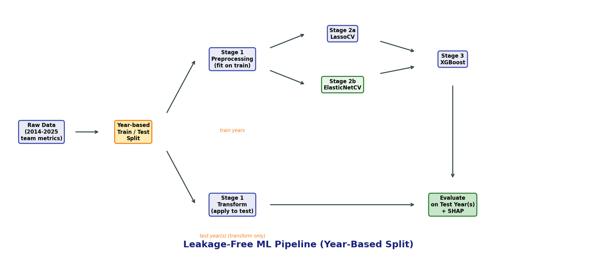
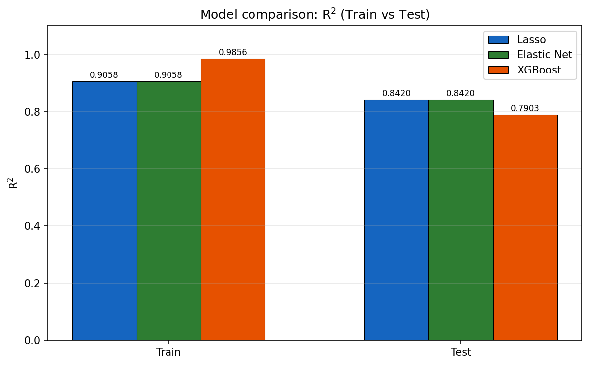
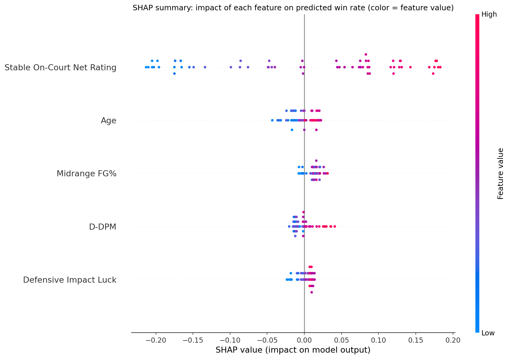

# NBA 球隊勝率預測（進階指標 × 機器學習）

以 **NBA 球隊—球季** 為單位，使用多維進階指標預測**勝率（Win Rate）**。本 repo 展示 **資料流程設計、防洩漏前處理、特徵篩選、多模型比較與 SHAP 解釋**，適合作為資料分析與 ML 作品集。

## 重要聲明（資料與授權）

- **本專案不附原始資料**。研究中使用之部分資料來源涉及**付費或授權限制**，不得於公開 repo 散布匯出檔、爬蟲細節或任何可重建該資料之敏感資訊（含帳密、token、cookies、session、headers、私有 API 等）。
- 公開版本僅包含：**管線程式、合成示範資料、欄位/schema 說明、評估圖表範例**。
- **使用者須自行準備具合法授權之資料**，並依 [`data/README.md`](data/README.md) 與 [`schema.json`](schema.json) 置於本機 `data/processed/`（該目錄已列於 `.gitignore`，不會進入 git）。
- 若 `data/processed/` 為空，執行 `main.py` 會改用 **`sample_data/processed/`** 內之**隨機合成 CSV**（僅供結構與程式可執行性展示，**非真實統計**）。

## 研究 / 預測目標

- **目標變數**：`Win Rate`（API 可傳 `win_rate`，會自動對應欄位）。
- **驗證方式**：依 **年度切分**（`year_holdout` / `rolling_year`）評估，降低時間洩漏。
- **模型管線**：共線性處理 → **LassoCV**、**ElasticNetCV** → **XGBoost**（網格搜尋）→ **SHAP** 與圖表。

## 資料思路

1. 在你具合法權利的來源取得「球隊—球季」層級面板。  
2. 依檔名規則 `YYYY_metrics.csv` 分季存放，合併後形成含 `year` 之面板。  
3. 詳見 [`data/README.md`](data/README.md)（表結構、建模 input 對應、本機放置方式）。

## 專案流程

```text
合法資料（本機 data/processed/）或 合成示範（sample_data/processed/）
        → 前處理與共線性篩選（僅在訓練段 fit）
        → LassoCV / ElasticNetCV
        → XGBoost + GridSearchCV
        → 評估與 SHAP / 圖表
```

## 目錄結構

| 路徑 | 說明 |
|------|------|
| `main.py` | 入口：解析資料目錄、執行完整管線、輸出至 `outputs/figures/`。 |
| `src/nba_win_rate_pipeline.py` | 核心管線（Stage 1–3 與繪圖）。 |
| `src/data_layout.py` | 解析 `data/processed/` 或退回 `sample_data/processed/`。 |
| `data/README.md` | **資料政策、表結構與放置說明**。 |
| `schema.json` | 抽象欄位/schema 說明。 |
| `sample_data/processed/` | 合成示範 `*_metrics.csv`（可進 git）。 |
| `scripts/generate_synthetic_sample.py` | 重產示範 CSV（同樣為合成，非真實賽事）。 |
| `notebooks/metric_selection/` | 特徵探索 notebook（讀取同上資料解析邏輯）。 |
| `assets/figures/` | README 用示意圖（重跑結果以本機為準）。 |
| `outputs/figures/` | 執行管線產出之圖表。 |
| `src/scraping/README.md` | 僅概念說明，**不含**可執行擷取程式。 |

## 使用技術

Python、pandas、NumPy、scikit-learn、XGBoost、SHAP、Matplotlib。

## 安裝

```bash
python -m venv .venv
.venv\Scripts\activate          # Windows
# source .venv/bin/activate    # macOS / Linux

pip install -r requirements.txt
```

## 執行

於專案根目錄：

```bash
python main.py
```

會自動選擇 `data/processed/`（若存在 `*_metrics.csv`）或否則使用 `sample_data/processed/`。

以程式呼叫：

```python
import sys
from pathlib import Path
ROOT = Path(__file__).resolve().parent  # 依你的檔案調整
sys.path.insert(0, str(ROOT / "src"))
from data_layout import resolve_processed_data_dir
from nba_win_rate_pipeline import load_metrics_from_csvs, run_full_pipeline

csv_dir = resolve_processed_data_dir(ROOT)
df = load_metrics_from_csvs(str(csv_dir))
# run_full_pipeline(df, split_mode="year_holdout", ...)
```

## 展示重點（作品集）

- 資料流程與面板合併設計  
- 特徵工程與共線性 / 正則化路徑  
- 多模型比較與時間切分評估  
- SHAP、係數圖、殘差與回測圖（見 `assets/figures/` 與本機 `outputs/figures/`）  

## 結果圖（示意）

以下為管線可能產出之圖表類型（實際數值以本機資料為準）。

| 類型 | 說明 |
|------|------|
| `pipeline_flowchart.png` | 管線階段總覽 |
| `feature_reduction.png` | 特徵數量變化 |
| `model_performance_comparison.png` | 模型測試表現對照 |
| `shap_summary.png` | 特徵貢獻解釋 |







## 未來可優化方向

- 更多球季與外生變數；機率校準與不確定性量化。  
- 與完全公開之資料來源做穩健性對照（在合規前提下）。  
- 模組化測試與 CI。

## 合規提醒

勿在 issue、PR 或截圖中张贴付費資料、帳密或可識別之私有匯出。若曾誤提交敏感檔，請輪替憑證並考慮清理 Git 歷史。
